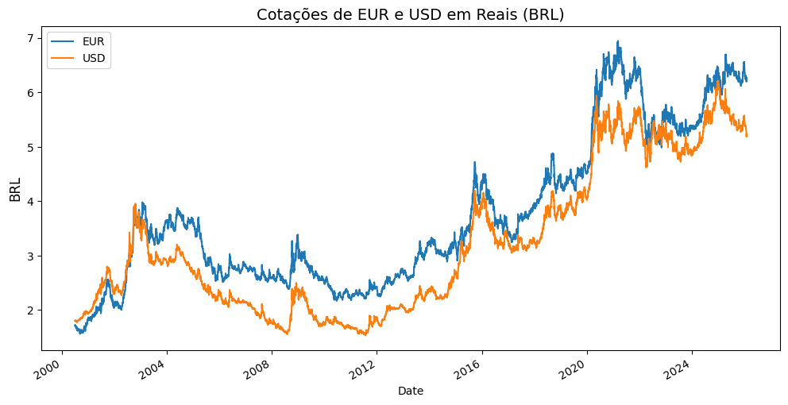
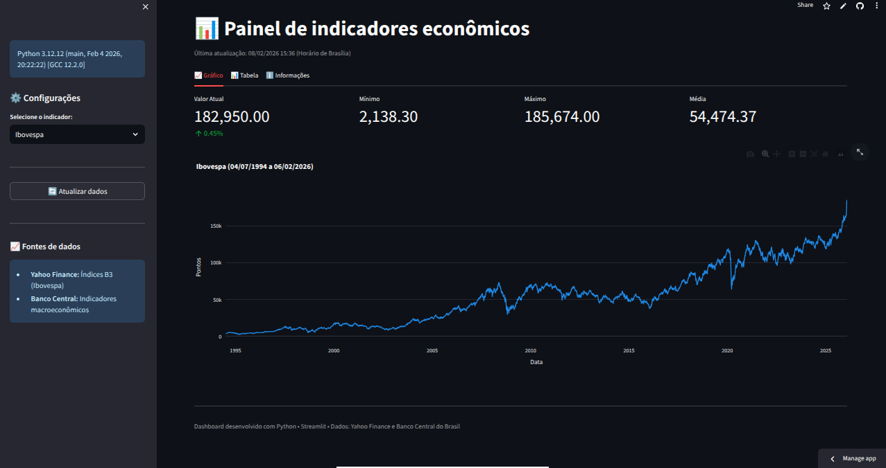

# Indicadores econômico-financeiros

O **Sistema Gerenciador de Séries Temporais (SGS)** do **Banco Central do Brasil (BACEN)** disponibiliza informações econômico-financeiras consolidadas.
A localização de séries pode ser feita de forma manual ou automatizada, por meio de serviços de consulta que utilizam a tecnologia de Web Services.

Para facilitar o acesso a esses dados, [Wilson Freitas](https://github.com/wilsonfreitas) desenvolveu o pacote [python-bcb](https://pypi.org/project/python-bcb/), uma interface em Python que permite consultar a API de dados abertos do Banco Central. Com ela, é possível acessar diretamente séries de moedas, taxas de juros, índices de preços, expectativas de mercado, entre outras informações.

Com base nessa fonte de dados, o presente tutorial demonstra a construção de um painel interativo. Inicialmente, exploramos os dados em um ambiente de análise (Jupyter Notebook) e, em seguida, convertemos o código em um aplicativo web implantado publicamente.

### Importamos as bibliotecas


```python
from matplotlib import pyplot as plt
import seaborn as sns
import pandas as pd
from pandas_market_calendars import get_calendar
from datetime import datetime, timedelta
from bcb import sgs
import sgs
import plotly.express as px
import plotly.graph_objects as go
import ipywidgets as widgets
from IPython.display import display
import functools
import time
import warnings
warnings.simplefilter(action='ignore', category=FutureWarning)

```

### Exploramos algumas APIs

**Conversor de moedas**

Conjunto de funções que realiza *webscraping* no site do [Conversor de Moedas](https://www.bcb.gov.br/conversao) do Banco Central.


```python
# Obter dados
df = currency.get(['USD', 'EUR'],
                 start='2000-07-01',
                 end='2026-01-31',
                 side='ask')

# Plotar gráfico
ax = df.plot(figsize=(12, 6))

# Definir rótulo do eixo Y como "BRL" (correto, pois os valores estão em Reais)
ax.set_ylabel("BRL", fontsize=12)

# Opcional: Título do gráfico
ax.set_title("Cotações de EUR e USD em Reais (BRL)", fontsize=14)

# Mostrar gráfico
plt.show()
```


    

    


**Atualizamos a rotina para conversão de moedas**

Agora, no lugar do **Matplotlib** usamos **Plotly**, biblioteca de código aberto para visualização de dados em Python, cuja principal característica é a interatividade.

No código abaixo, adotamos o calendário da **B3** para identificar os dias úteis.


```python
# Obter calendário da B3 e encontrar o último dia útil VÁLIDO
cal = get_calendar('B3')
end_date = cal.valid_days(
    start_date=pd.Timestamp.now() - timedelta(days=30),  # Janela de 30 dias para garantir
    end_date=pd.Timestamp.now() - timedelta(days=1)      # Sempre pega até ontem
).max().strftime('%Y-%m-%d')

# Buscar dados
df = currency.get(['USD', 'EUR'],
                 start='2000-07-01',
                 end=end_date,
                 side='ask').reset_index()

# Gráfico interativo
fig = px.line(df, 
              x='Date', 
              y=['USD', 'EUR'],
              title=f'Cotações até {end_date}',
              labels={'value': 'BRL', 'variable': 'Moeda', 'Date': 'Data'})

# Adicionar slider de tempo
fig.update_layout(hovermode='x unified', xaxis=dict(rangeslider=dict(visible=True)))
fig.show()
```


**PTAX**

Fornece os boletins diários de taxas de câmbio do Banco Central.


```python
from bcb import PTAX

ptax = PTAX()

ep = ptax.get_endpoint('CotacaoMoedaPeriodo')
(ep.query()
   .parameters(moeda='USD',
               dataInicial='1/8/2026',
               dataFinalCotacao='1/13/2026')
   .limit(5)
   .collect())
```


<div>

<table border="1" class="dataframe">
  <thead>
    <tr style="text-align: right;">
      <th></th>
      <th>paridadeCompra</th>
      <th>paridadeVenda</th>
      <th>cotacaoCompra</th>
      <th>cotacaoVenda</th>
      <th>dataHoraCotacao</th>
      <th>tipoBoletim</th>
    </tr>
  </thead>
  <tbody>
    <tr>
      <th>0</th>
      <td>1.0</td>
      <td>1.0</td>
      <td>5.3808</td>
      <td>5.3814</td>
      <td>2026-01-08 10:02:27.805</td>
      <td>Abertura</td>
    </tr>
    <tr>
      <th>1</th>
      <td>1.0</td>
      <td>1.0</td>
      <td>5.3855</td>
      <td>5.3861</td>
      <td>2026-01-08 11:08:26.052</td>
      <td>Intermediário</td>
    </tr>
    <tr>
      <th>2</th>
      <td>1.0</td>
      <td>1.0</td>
      <td>5.3866</td>
      <td>5.3872</td>
      <td>2026-01-08 12:05:32.250</td>
      <td>Intermediário</td>
    </tr>
    <tr>
      <th>3</th>
      <td>1.0</td>
      <td>1.0</td>
      <td>5.3886</td>
      <td>5.3892</td>
      <td>2026-01-08 13:04:28.611</td>
      <td>Intermediário</td>
    </tr>
    <tr>
      <th>4</th>
      <td>1.0</td>
      <td>1.0</td>
      <td>5.3854</td>
      <td>5.3860</td>
      <td>2026-01-08 13:04:28.616</td>
      <td>Fechamento</td>
    </tr>
  </tbody>
</table>
</div>


**Expectativas do mercado**

Fornece estatísticas das variáveis macroeconômicas fornecidos por um conjuto de instituições do mercado financeiro.

**IPCA**


```python
em = Expectativas()
ep = em.get_endpoint("ExpectativasMercadoAnuais")

df_ipca_2026 = (
    ep.query()
      .filter(ep.Indicador == "IPCA")
      .filter(ep.Data >= "2026-01-01", ep.Data <= "2026-12-31")
      .filter(ep.DataReferencia == "2026", ep.baseCalculo == 1)
      .orderby(ep.Data.asc())
      .select(ep.Data, ep.Media, ep.Mediana)
      .limit(5)
      .collect()
)

df_ipca_2026
```


<div>

<table border="1" class="dataframe">
  <thead>
    <tr style="text-align: right;">
      <th></th>
      <th>Data</th>
      <th>Media</th>
      <th>Mediana</th>
    </tr>
  </thead>
  <tbody>
    <tr>
      <th>0</th>
      <td>2026-01-02</td>
      <td>4.0719</td>
      <td>3.9929</td>
    </tr>
    <tr>
      <th>1</th>
      <td>2026-01-05</td>
      <td>4.1218</td>
      <td>4.0207</td>
    </tr>
    <tr>
      <th>2</th>
      <td>2026-01-06</td>
      <td>4.0732</td>
      <td>4.0006</td>
    </tr>
    <tr>
      <th>3</th>
      <td>2026-01-07</td>
      <td>4.0642</td>
      <td>3.9902</td>
    </tr>
    <tr>
      <th>4</th>
      <td>2026-01-08</td>
      <td>4.0593</td>
      <td>3.9958</td>
    </tr>
  </tbody>
</table>
</div>


**SELIC**


```python
em = Expectativas()
#ep = em.get_endpoint("ExpectativasMercadoAnuais")

ep = em.get_endpoint('ExpectativasMercadoSelic')
ep.query().filter(ep.baseCalculo == 0, ep.Data == '2025-12-10').collect()

df_selic_2026 = (
    ep.query().
        filter(ep.baseCalculo == 0, ep.Data == '2025-12-10')
        .limit(5)
        .collect()

)

df_selic_2026
```


<div>
<style scoped>
    .dataframe tbody tr th:only-of-type {
        vertical-align: middle;
    }

    .dataframe tbody tr th {
        vertical-align: top;
    }

    .dataframe thead th {
        text-align: right;
    }
</style>
<table border="1" class="dataframe">
  <thead>
    <tr style="text-align: right;">
      <th></th>
      <th>Indicador</th>
      <th>Data</th>
      <th>Reuniao</th>
      <th>Media</th>
      <th>Mediana</th>
      <th>DesvioPadrao</th>
      <th>Minimo</th>
      <th>Maximo</th>
      <th>numeroRespondentes</th>
      <th>baseCalculo</th>
    </tr>
  </thead>
  <tbody>
    <tr>
      <th>0</th>
      <td>Selic</td>
      <td>2025-12-10</td>
      <td>R7/2027</td>
      <td>10.4388</td>
      <td>10.50</td>
      <td>0.8675</td>
      <td>8.50</td>
      <td>13.0</td>
      <td>98</td>
      <td>0</td>
    </tr>
    <tr>
      <th>1</th>
      <td>Selic</td>
      <td>2025-12-10</td>
      <td>R6/2027</td>
      <td>10.6128</td>
      <td>10.50</td>
      <td>0.8968</td>
      <td>8.50</td>
      <td>13.0</td>
      <td>113</td>
      <td>0</td>
    </tr>
    <tr>
      <th>2</th>
      <td>Selic</td>
      <td>2025-12-10</td>
      <td>R5/2027</td>
      <td>10.8004</td>
      <td>10.75</td>
      <td>0.8754</td>
      <td>8.50</td>
      <td>13.0</td>
      <td>119</td>
      <td>0</td>
    </tr>
    <tr>
      <th>3</th>
      <td>Selic</td>
      <td>2025-12-10</td>
      <td>R4/2027</td>
      <td>11.0210</td>
      <td>11.00</td>
      <td>0.8461</td>
      <td>8.75</td>
      <td>13.0</td>
      <td>119</td>
      <td>0</td>
    </tr>
    <tr>
      <th>4</th>
      <td>Selic</td>
      <td>2025-12-10</td>
      <td>R3/2027</td>
      <td>11.2836</td>
      <td>11.25</td>
      <td>0.7662</td>
      <td>9.25</td>
      <td>13.0</td>
      <td>119</td>
      <td>0</td>
    </tr>
  </tbody>
</table>
</div>


### Desenvolvemos um aplicativo

Etapas para a criação de um aplicativo de visualização de indicadores básicos:

* Definir e verificar os indicadores que comporão o painel.

* Criar um repositório e enviar os arquivos ao **GitHub**.

*  Realizar o deploy no **Streamlit Cloud**.


### Selecionamos os indicadores

No [SGS - Sistema Gerenciador de Séries Temporais](https://www3.bcb.gov.br/sgspub/localizarseries/localizarSeries.do?method=prepararTelaLocalizarSeries), realizamos a pesquisa textual para identificar o código dos indicadores desejados.

Selecionamos os seguintes indicadores:
'Ibovespa': {'codigo': 7832, 'unidade': 'Pontos'}
'PIB Indústria': {'codigo': 4383, 'unidade': 'milhões de reais'}
'Taxa Selic': {'codigo': 4189, 'unidade': '% ao ano'}
'IPCA Mensal': {'codigo': 433, 'unidade': '%'}
'Câmbio USD/BRL': {'codigo': 3696, 'unidade': 'R$'}
'Taxa de Desemprego': {'codigo': 24369, 'unidade': '%'}


### Verificamos os intervalos disponíveis


```python
lista = {7832, 4380, 4189, 433, 3696, 24369}

for codigo in lista:
    print(f"\nCódigo: {codigo}")
    print("-" * 50)
    
    resultados = sgs.search_ts(codigo, language='pt')
    
    if resultados:
        for i, resultado in enumerate(resultados, 1):
            print(f"Resultado {i}:")
            print(f"  Nome: {resultado.get('name', 'N/A')}")
            print(f"  Unidade: {resultado.get('unit', 'N/A')}")
            print(f"  Período: {resultado.get('first_value', 'N/A')} a {resultado.get('last_value', 'N/A')}")
            print(f"  Frequência: {resultado.get('frequency', 'N/A')}")
            print()
    else:
        print("Nenhum resultado encontrado")
    
    print("=" * 70)
```

    
    Código: 3696
    --------------------------------------------------
    Resultado 1:
      Nome: Taxa de câmbio - Livre - Dólar americano (venda) - Fim de período - mensal
      Unidade: u.m.c./US$
      Período: 1953-01-31 00:00:00 a 2026-01-01 00:00:00
      Frequência: M
    
    ======================================================================
    
    Código: 433
    --------------------------------------------------
    Resultado 1:
      Nome: Índice nacional de preços ao consumidor-amplo (IPCA)
      Unidade: Var. % mensal
      Período: 1980-01-01 00:00:00 a 2025-12-01 00:00:00
      Frequência: M
    
    ======================================================================
    
    Código: 24369
    --------------------------------------------------
    Resultado 1:
      Nome: Taxa de desocupação - PNADC
      Unidade: %
      Período: 2012-03-01 00:00:00 a 2025-12-01 00:00:00
      Frequência: M
    
    ======================================================================
    
    Código: 7832
    --------------------------------------------------
    Resultado 1:
      Nome: Ibovespa - Variação percentual mensal
      Unidade: %
      Período: 1987-01-31 00:00:00 a 2019-08-01 00:00:00
      Frequência: M
    
    ======================================================================
    
    Código: 4380
    --------------------------------------------------
    Resultado 1:
      Nome: PIB mensal - Valores correntes (R$ milhões)
      Unidade: R$ (milhões)
      Período: 1990-01-31 00:00:00 a 2025-12-01 00:00:00
      Frequência: M
    
    ======================================================================
    
    Código: 4189
    --------------------------------------------------
    Resultado 1:
      Nome: Taxa de juros - Selic acumulada no mês anualizada base 252
      Unidade: % a.a.
      Período: 1986-07-31 00:00:00 a 2026-02-01 00:00:00
      Frequência: M
    
    ======================================================================


### Modificamos a fonte dos dados para o índice ibovespa

Considerando que a série temporal do índice ibovespa no **sgs** foi interrompida em 2019, optamos por carregar os dados do *Yahoo Finance*, através da biblioteca **yfinance** do Python.

### Estruturamos o projeto

Para transformar a análise em um aplicativo web acessível, utilizamos a biblioteca **Streamlit**. As etapas a seguir envolvem a configuração do ambiente e a reestruturação do código.

```raw
dashboard_indicadores/
├── app/
│   └── pages/
│       └── dashboard.py
├── requirements.txt
├── runtime.txt
```
    
### Instalamos as dependências

Na raíz do projeto, o arquivo *requirements.txt* deve listar as dependências:

```raw
# Streamlit Cloud - Python 3.12 Compatible
streamlit==1.28.0
yfinance==1.1.0
pandas==2.1.4
numpy==1.26.4  # ← MUDADO: compatível com pandas 2.1.4
plotly==5.18.0
python-bcb==0.3.3
lxml==4.9.3
requests==2.31.0
```

# Adicione estas linhas para resolver distutils
setuptools==69.0.3
wheel==0.42.0
Opcionalmente, adicione o arquivo *runtime.txt* na raiz do projeto, para especificar a versão do Python compatível com as dependências definidas no arquivo *requirements.txt*.
python-3.12.0
```

### Definimos o motor do projeto

O aquivo *dashboard.py*:
* Centraliza toda a lógica
* Coordena todos os componentes
* Expõe a interface ao usuário
* Gerencia estado e dados
* É o ponto de entrada único da aplicação


```python
import streamlit as st

# Configuração da página
st.set_page_config(
    page_title="Painel de indicadores econômicos",
    page_icon="📈",
    layout="wide",
    initial_sidebar_state="expanded"
)

import yfinance as yf
import pandas as pd
from datetime import datetime, timedelta, timezone
import plotly.graph_objects as go
import warnings
import sys
import pytz

try:
    from bcb import sgs
except ImportError:
    # Fallback para versões antigas
    import sys
    import subprocess
    subprocess.check_call([sys.executable, "-m", "pip", "install", "bcb==1.1.0"])
    from bcb import sgs

# Verificar versão do Python
st.sidebar.info(f"Python {sys.version}")

# Suprimir warnings
warnings.filterwarnings("ignore", category=FutureWarning)

def main():

    # Configuração inicial com fuso horário
    def get_brasil_time():
        """Retorna o horário atual de Brasília (America/Sao_Paulo)"""
        try:
            # Método mais robusto com pytz
            brasil_tz = pytz.timezone('America/Sao_Paulo')
            return datetime.now(brasil_tz)
        except:
            # Fallback para UTC-3
            return datetime.now(timezone.utc) - timedelta(hours=3)
    
    start_date = '1994-07-01'
    end_date = (get_brasil_time() + timedelta(days=1)).strftime('%Y-%m-%d')
    
    # Dicionário de indicadores
    indicadores = {
        'Ibovespa': {'codigo': '^BVSP', 'fonte': 'YF', 'unidade': 'Pontos'},
        'PIB Total': {'codigo': 4380, 'fonte': 'BCB', 'unidade': 'R$ milhões'},
        'Taxa Selic': {'codigo': 4189, 'fonte': 'BCB', 'unidade': '% ao ano'},
        'IPCA Mensal': {'codigo': 433, 'fonte': 'BCB', 'unidade': '%'},
        'Câmbio USD/BRL': {'codigo': 3696, 'fonte': 'BCB', 'unidade': 'R$'},
        'Taxa de Desemprego': {'codigo': 24369, 'fonte': 'BCB', 'unidade': '%'},
    }
    
    # Cache otimizado
    @st.cache_data(ttl=3600, show_spinner="Carregando dados...")
    def fetch_yfinance_data(ticker: str, start_date: str, end_date: str) -> pd.DataFrame:
        """Busca dados do Yahoo Finance com tratamento robusto"""
        try:
            # PARA yfinance 1.1.0 - parâmetros corretos
            data = yf.download(
                tickers=ticker,
                start=start_date,
                end=end_date,
                auto_adjust=True,
                progress=False,
                timeout=30,
                threads=True
                # NÃO USAR: show_errors (não existe na 1.1.0)
            )
            
            if data.empty:
                st.warning(f"⚠️ Nenhum dado encontrado para {ticker}")
                return pd.DataFrame()
            
            # Verifica se temos a coluna Close
            if 'Close' in data.columns:
                df_result = data[['Close']].copy()
                df_result.columns = [ticker]
                return df_result
            elif len(data.columns) > 0:
                # Pega primeira coluna disponível
                df_result = data.iloc[:, [0]].copy()
                df_result.columns = [ticker]
                return df_result
            
            return pd.DataFrame()
            
        except Exception as e:
            st.error(f"❌ Erro ao buscar {ticker}: {str(e)}")
            return pd.DataFrame()
    
    # Função principal para baixar dados
    @st.cache_data(ttl=1800)
    def baixar_dados(indicador_nome: str) -> pd.DataFrame:
        """Baixa dados do indicador selecionado"""
        indicador_info = indicadores.get(indicador_nome)
        
        if not indicador_info:
            st.error(f"Indicador {indicador_nome} não encontrado")
            return pd.DataFrame()
        
        try:
            if indicador_info['fonte'] == 'YF':
                return fetch_yfinance_data(indicador_info['codigo'], start_date, end_date)
            else:
                # BCB data
                df = sgs.get(
                    {indicador_nome: indicador_info['codigo']},
                    start=start_date,
                    end=end_date
                )
                return df
        except Exception as e:
            st.error(f"Erro ao processar {indicador_nome}: {e}")
            return pd.DataFrame()
    
    # Interface
    st.title("📊 Painel de indicadores econômicos")
    st.caption(f"Última atualização: {get_brasil_time().strftime('%d/%m/%Y %H:%M')} (Horário de Brasília)")
    
    # Sidebar
    with st.sidebar:
        st.header("⚙️ Configurações")
        
        indicador_selecionado = st.selectbox(
            "**Selecione o indicador:**",
            options=list(indicadores.keys()),
            index=0
        )
        
        st.divider()
        
        # Botão de atualização corrigido
        if st.button("🔄 Atualizar dados", type="secondary", use_container_width=True):
            # Limpa cache específico
            fetch_yfinance_data.clear()
            baixar_dados.clear()
            st.rerun()
        
        st.divider()
        st.markdown("### 📈 Fontes de dados")
        st.info("""
        - **Yahoo Finance:** Índices B3 (Ibovespa)
        - **Banco Central:** Indicadores macroeconômicos
        """)
    
    # Layout principal
    tab1, tab2, tab3 = st.tabs(["📈 Gráfico", "📊 Tabela", "ℹ️ Informações"])
    
    with tab1:
        with st.spinner("Carregando dados..."):
            dados = baixar_dados(indicador_selecionado)
        
        if not dados.empty and len(dados) > 0:
            col1, col2, col3, col4 = st.columns(4)
            
            with col1:
                valor_atual = dados.iloc[-1, 0]
                delta = None
                if len(dados) > 1:
                    try:
                        delta = ((dados.iloc[-1, 0] / dados.iloc[-2, 0]) - 1) * 100
                    except:
                        delta = None
                
                st.metric(
                    label="Valor Atual",
                    value=f"{valor_atual:,.2f}",
                    delta=f"{delta:.2f}%" if delta is not None else None,
                    delta_color="normal"
                )
            
            with col2:
                st.metric("Mínimo", f"{dados.min().iloc[0]:,.2f}")
            
            with col3:
                st.metric("Máximo", f"{dados.max().iloc[0]:,.2f}")
            
            with col4:
                st.metric("Média", f"{dados.mean().iloc[0]:,.2f}")
            
            # Gráfico
            fig = go.Figure()
            
            # Escolhe cor baseada no tipo de indicador
            if any(x in indicador_selecionado for x in ['Taxa', 'IPCA', 'Desemprego']):
                cor = '#FF6B6B'
                fill = 'tozeroy'
            else:
                cor = '#1E88E5'
                fill = None
            
            fig.add_trace(go.Scatter(
                x=dados.index,
                y=dados[dados.columns[0]],
                name=indicador_selecionado,
                line=dict(width=2, color=cor),
                fill=fill,
                mode='lines'
            ))
            
            fig.update_layout(
                title=f"{indicador_selecionado} ({dados.index.min().strftime('%d/%m/%Y')} a {dados.index.max().strftime('%d/%m/%Y')})",
                xaxis_title="Data",
                yaxis_title=indicadores[indicador_selecionado]['unidade'],
                height=500,
                hovermode="x unified",
                template="plotly_white"
            )
            
            st.plotly_chart(fig, use_container_width=True)
        else:
            st.error(f"⚠️ Não foi possível carregar dados para {indicador_selecionado}")
            st.info("Verifique sua conexão com a internet ou tente outro indicador.")
    
    with tab2:
        if 'dados' in locals() and not dados.empty:
            st.subheader("Dados Tabelados")
            
            # Formatação
            dados_display = dados.copy()
            dados_display.index = dados_display.index.strftime('%d/%m/%Y')
            dados_display.columns = [f"{indicador_selecionado}"]
            
            st.dataframe(
                dados_display.sort_index(ascending=False),
                use_container_width=True,
                height=400
            )
            
            # Download
            csv = dados.to_csv()
            st.download_button(
                label="📥 Download CSV",
                data=csv,
                file_name=f"{indicador_selecionado.replace(' ', '_').lower()}.csv",
                mime="text/csv"
            )
    
    with tab3:
        st.subheader(f"Informações sobre {indicador_selecionado}")
        
        descricoes = {
            'Ibovespa': "Principal indicador do desempenho médio das cotações das ações negociadas na B3.",
            'PIB Total': "Produto Interno Bruto - soma de todos os bens e serviços finais produzidos.",
            'Taxa Selic': "Taxa básica de juros da economia brasileira, definida pelo COPOM.",
            'IPCA Mensal': "Índice Nacional de Preços ao Consumidor Amplo - inflação oficial do Brasil.",
            'Câmbio USD/BRL': "Taxa de câmbio dólar americano/real brasileiro.",
            'Taxa de Desemprego': "Porcentagem da população economicamente ativa que está desempregada."
        }
        
        st.info(descricoes.get(indicador_selecionado, "Indicador econômico."))
        
        if not dados.empty:
            st.write(f"**Unidade:** {indicadores[indicador_selecionado]['unidade']}")
            st.write(f"**Fonte:** {indicadores[indicador_selecionado]['fonte']}")
            st.write(f"**Período disponível:** {dados.index.min().strftime('%d/%m/%Y')} a {dados.index.max().strftime('%d/%m/%Y')}")
            st.write(f"**Total de observações:** {len(dados)}")
    
    # Rodapé
    st.divider()
    st.caption("Dashboard desenvolvido com Python • Streamlit • Dados: Yahoo Finance e Banco Central do Brasil")

if __name__ == "__main__":
    main()
```

### Layout



### Considerações finais

O código acima resulta em um painel interativo e auto-atualizável. A seção final detalha o processo de implantação (deploy) na nuvem para torná-lo publicamente acessível.

Visualize o painel interativo em: https://dashboardindicadores.streamlit.app/

______________________________________________________________________________________________________________________________________________________

**Pré-requisitos**
- Conta no [Streamlit](https://streamlit.io/)
- Conta no GitHub/GitLab (opcional)

**Método 1: Deploy via Git**
1. Acesse [Streamlit](share.streamlit.io)
2. Faça login com sua conta do GitHub
3. Clique: "Create app"
4. Clique: "Create a public app from GitHub"
5. Selecione:
   - Repo: seu-repositorio-github
   - Branch: main
   - Main file path: caminho-do-arquivo-no-repositório
6. Clique em "Deploy"


**Atenção**

Verifique se o arquivo *requirements.txt* está na raiz do repositório.

**Método 2: Deploy via CLI**
```bash
# Instale a CLI do Streamlit
pip install streamlit
streamlit config show  # Verifica configurações

# Tenta deploy direto
streamlit run arquivo.py --server.port=8501
```

**Formas de compartilhar:**

1. **Link direto**: https://seu-app.streamlit.app
2. **QR Code**: Gerar para acesso mobile
3. **Embed**: Em blogs/sites (se necessário)

   
**Para Acessar logs:**
1. No **Streamlit Cloud**: Seu app → ⋯ (menu) → View app logs
2. Ou via **URL**: https://dashboardindicadores.streamlit.app//_logs
   
**Atualizações futuras:**

Quando fizer mudanças no GitHub:

1. Commit e push para o branch main
2. **Streamlit Cloud** detecta automaticamente
3. Faz *redeploy* instatâneo


```python

```
